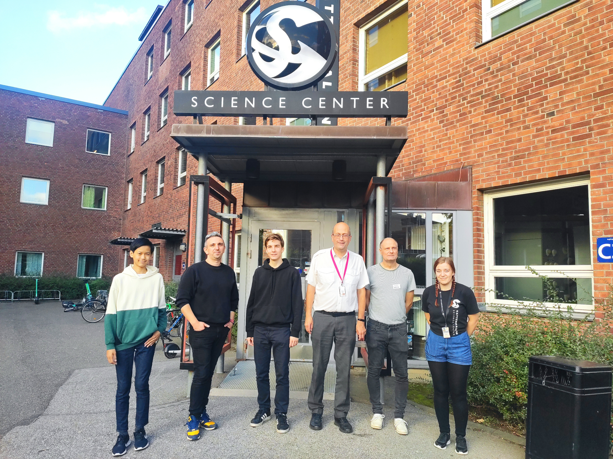

# CoderDojo Lund, Sweden

**Datorprogrammering för dig som är 7 till 17 år. Inga förkunskaper. Begränsat antal platser.** 🇺🇦 🇺🇦

>Har du sett att vår samarbetspartner Vattenhallen Science Center har aktiviteter på söndagseftermiddagar? Kolla in [Vetenskapsverkstan här](https://www.vattenhallen.lu.se/vetenskapsverkstan/vaar-hoest/). Förutom temat **Programmering och robotar 🤖**  kan du också testa **Spännande kemi ⚗️**. 

<!--Ticket Tailor Widget. Paste this into your website where you want the widget to appear. Do not change the code or the widget may not work properly.-->

 

<!--End of Ticket Tailor Widget-->

    

- Bokningen öppnar ungefär en månad i förväg
- Det går bara att väntelista en ninja åt gången. Vill du väntelista flera så upprepa bokningsproceduren
- Anmälan är obligatorisk för fikaplaneringens skull :) och man anmäler/väntelistar sig till varje tillfälle
- Måndagar, udda vecka, håller vi till på Alfatorget i Alfa 6 med ingång från Scheelevägen 15H. [Google Maps: Ekonomihögskolans bibliotek](https://maps.app.goo.gl/ubgcMqqw7idD7JLJ6)
- Tisdagar, jämn vecka, är vi på Vattenhallen Science Center, John Ericssons väg 1E. [Google Maps](https://maps.app.goo.gl/TMhEfFPGSss6qcQb9)

**Hur fungerar väntelistan?** Vi skickar besked via mejl om det blir platser lediga, ibland med kort varsel. En väntelistning gäller bara det givna datumet. Vi förbehåller oss rätten att ta in ungdomar av underrepresenterat kön oavsett plats på väntelistan.

**Är CoderDojo en kurs?** Nej, det är inte en vanlig kurs där du måste delta varje gång. Anmäl dig så att vi vet hur mycket fika som kommer att gå åt.

**Vad händer under de två timmarna?** Du behöver ha med dator eller boka lånedator. Mentorerna ger några förslag på hur du kan komma igång med programmering. Välj något du tycker är kul och försök att lösa uppgiften. Du behöver inte utgå från förslagen utan det går utmärkt att göra något utifrån egna idéer. Behöver du hjälp så finns mentorerna där för din skull.

**Vilka får vara med?** Barn och ungdomar 7&ndash;17 år. Barn under 12 behöver ha sällskap av en vuxen.

**Vem driver CoderDojo?** Det är inte ett företag eller organisation som ligger bakom CoderDojo Lund, utan vi kommer från många olika håll, bland annat Robert Bosch, VertiGIS, Acconeer och Lunds Universitet. Vi samarbetar med vår förebild CoderDojo Malmö som drivs av Foo Café.

Vi är många! CoderDojo Lund ingår i nätverket CoderDojo som är en irländsk, global och ideell rörelse med klubbar för barn och ungdomar som vill lära sig att programmera.
Vi finns också på [Facebook](https://www.facebook.com/CoderDojoLund/).

**Kan jag vara mentor eller sponsringsansvarig?** Javisst, kontakta oss!

Tack till [Sparbanken Skåne](https://www.sparbankenskane.se) för sponsring och till [Qlik](https://www.qlik.com/us) och [Sony Mobile i Lund](https://electronics.sony.com) för lånedatorer. 
Tack också till [Robert Bosch](https://www.bosch.se/nyheter/bosch-r-d-lund/) och [VertiGIS](https://support.vertigis.com/hc/sv) för sponsrad arbetstid.

## Vi startade 2012 som ett samarbete med Tunaskolan

[Olle Strömbeck, en av våra grundare, presenterade CoderDojo redan på TeachMeet Syd 2012 i Lund](https://www.youtube.com/watch?v=YsHCjSjgzx4)

