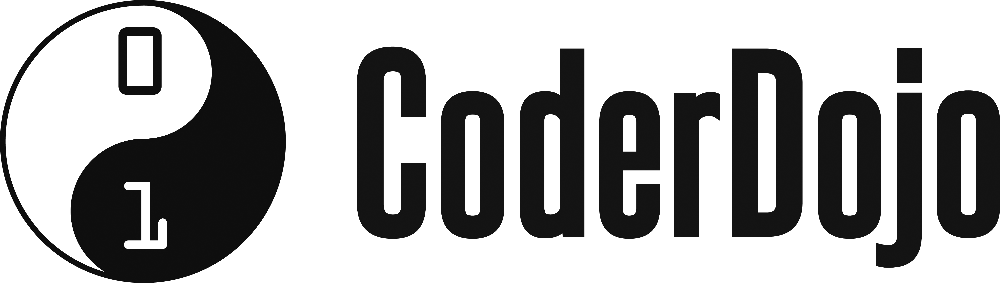

# Uppgifter du kan pröva

- [kodboken.se](https://kodboken.se) från Kodcentrum
- [Malins uppgifter](https://cmc.education/scratch/tasks/) &ndash; lite svårare uppgifter i Scratch
- [Project ideas in English](https://www.raspberrypi.org/learn/) &ndash; Raspberrypi.org, Scratch and Python
- [Edison: edscratchapp](https://www.edscratchapp.com/)
- [Makecode](https://makecode.microbit.org/) för micro:bit
- Stegräknare 👣 med micro:bit: [projektlänk](https://docs.google.com/presentation/d/1f06PC-3T8S-5Tr3eow9a-iC6ivipcMT8cknaG8SdFxY/edit?usp=sharing)
- maqueen med micro:bit: [projektlänk](https://wiki.dfrobot.com/micro_Maqueen_Lite_for_micro_bit_SKU_ROB0148-EN-L#target_4)
- Astro Pi [Mission Zero](https://astro-pi.org/sv/mission-zero) &ndash; 🧑‍🚀 gläd en astronaut med Python
- Programspråket Kojo: [direkt i webbläsaren](http://kojo.lu.se/) eller om du vill [installera det på din dator](https://www.lth.se/programmera/programmering-i-skolan/)
- [Learn X in Y minutes](https://learnxinyminutes.com/): en sida per programspråk, t.ex. [Python](https://learnxinyminutes.com/docs/python/), [Lua (Roblox)](https://learnxinyminutes.com/docs/lua/)

{: width="40%"}
